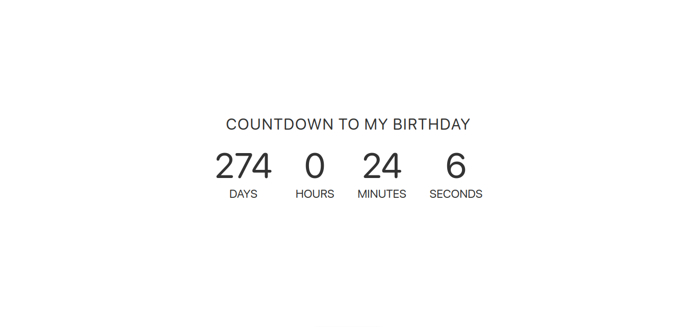

# project 3 - CountDown birthday

Mostrar el tiempo que queda hasta tu cumpleaños

## Requisitos:

- [x] Solo con segundos
- [x] Con segundos, minutos, horas 
- [x] Añadir días
- [x] Que pase algo cuando el contador llegue a cero (un sonido, confetti…)

[Ver ejemplo de Cuenta atrás](https://codepen.io/AllThingsSmitty/pen/JJavZN)
